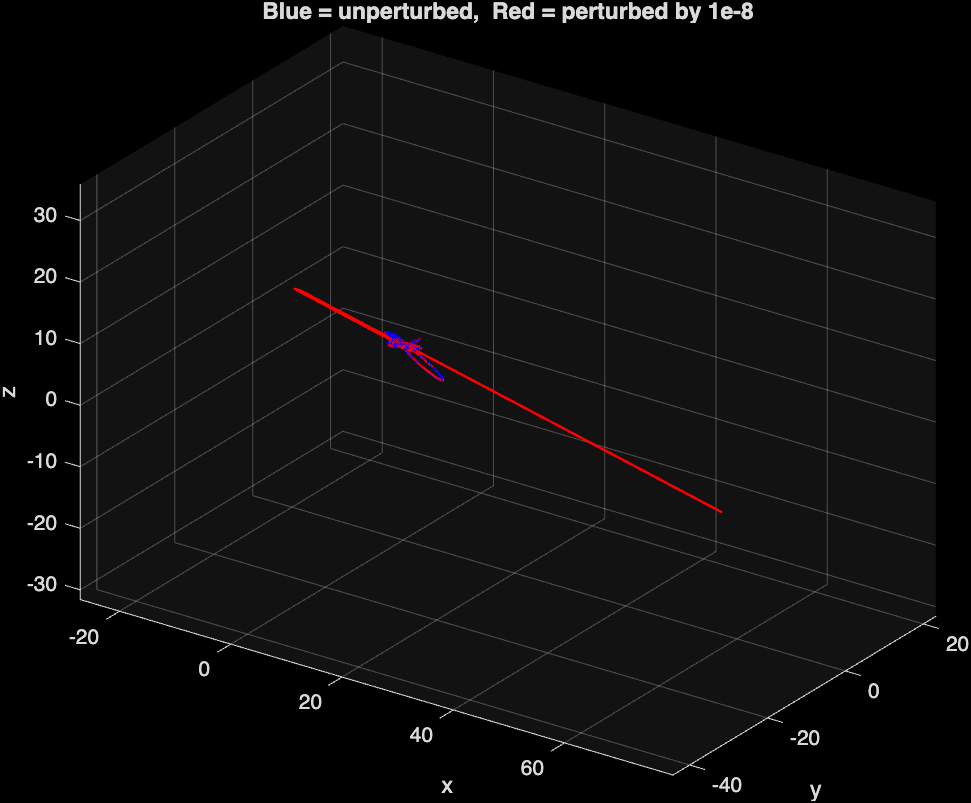

# Gravity Simulations: From a Stable Orbit to Chaos

Two MATLAB scripts that simulate gravitating bodies by numerically integrating Newton's equations of motion with ode45(via Runge Kutta method), and then plot the result. Note: The original coursework was to work out the modelling dynamic of two body system along with Newton's law and setting up the ODE on MatLab. 

- **`two_body_2d.m`** — the classic 2-body problem in a plane. One body orbits another in a fixed, repeating ellipse. 
- **`three_body_3d_chaos.m`** — precisely the same idea extended to **three** bodies in **3D**, used to demonstrate that adding just one more body turns a perfectly predictable system into a chaotic one. 
- Note: I have also added an extended version for the animating the three body as well.

## A Plot of result



## Why two scripts?

The 2-body problem is integrable: there's a closed-form solution, and two initial conditions that start close together stay close together forever. The moment you add a third gravitating body, no general closed-form solution exists, and the system becomes chaotic: two initial conditions that differ by a tiny amount can diverge completely after a while. The two scripts here are meant to be run side by side so you can see that contrast for yourself.


## `Two Body Oribit`

Solves the reduced Kepler problem in relative coordinates `(x, y)`, then reconstructs each body's position from the mass ratio. I annimated both bodies as filled circles orbiting their common center of mass over several periods.

- Masses: `m1 = 1`, `m2 = 4`
- Eccentricity: `e = 0.7`
- Integrator: `ode45`, `RelTol = 1e-6`

## Three-Body Problem in 3D — Sensitivity to Initial Conditions

Simulates the gravitational motion of three bodies in 3D and shows how a
tiny change in the starting conditions leads to a completely different
trajectory — a signature of chaos. Unlike the 2-body problem, which has a
closed-form, stable solution, the 3-body problem has no general analytic
solution and is generically chaotic.

The script runs two simulations from (almost) the same starting point:

- **Unperturbed run** — the three bodies start from rest at a
  Pythagorean-triangle configuration (masses 3, 4, 5), tilted slightly
  out of the xy-plane so the motion is genuinely 3D.
- **Perturbed run** — identical, except the x-coordinate of body 1 is
  nudged by `1e-8`.

Both are integrated with `ode45` over `t = 0` to `150` and plotted
together on the same 3D axes (blue = unperturbed, red = perturbed), so
the point where the two trajectories split apart is visible directly.
The final separation distance between the two runs is printed to the
console as a numeric check.

## How it works

1. **Setup** — define masses, initial positions/velocities, and build
   the perturbed initial state.
2. **Solve** — integrate the equations of motion for both initial
   conditions using `ode45` with tight tolerances (chaotic systems need
   high accuracy to trust the result).
3. **Plot** — overlay both runs' paths for all three bodies on one set
   of axes.
4. **Report** — compute and print how far apart the two runs end up.

## Equations of motion

```
d(position)/dt = velocity
d(velocity)/dt = sum over other bodies of  G * m_j * (r_j - r_i) / |r_j - r_i|^3
```

State vector is `[positions (9); velocities (9)]`, 3 coordinates × 3
bodies each.

## Things to try

- Increase `Tmax` if the two runs haven't visibly diverged yet — the
  gap only grows noticeably after a close encounter between bodies.
- Change the perturbation size (`1e-8`) to see how it affects when the
  divergence appears.
- Change `r0` for a different starting configuration.


## Requirements

- MATLAB (R2016b or later)


## What the script does?

1. Integrates the equations of motion with `ode45`.
2. Opens one or more figure windows with the static plots.
3. Runs a live animation in a figure window (uses `drawnow`, so it needs a display). 

**Note:** the animation loops use `drawnow` and therefore expect a graphical display. If you're running headlessly (e.g. in CI, or over SSH without X forwarding), comment out the animation section, or run with a virtual display (e.g. `xvfb-run octave three_body_3d_chaos.m`).

## Ideas for extending this(in the future)

- Increase `N` and add more bodies to `three_body_3d_chaos.m` (the equations of motion are already written generally for any number of bodies).
- Perturb a different coordinate, or a different body, and compare how quickly it diverges.
- Try a different chaos-adjacent three-body starting configuration (e.g. the figure-eight orbit is famously *not* chaotic — a nice contrast case).
- Plot total energy and angular momentum over time as a sanity check on the integration accuracy.


